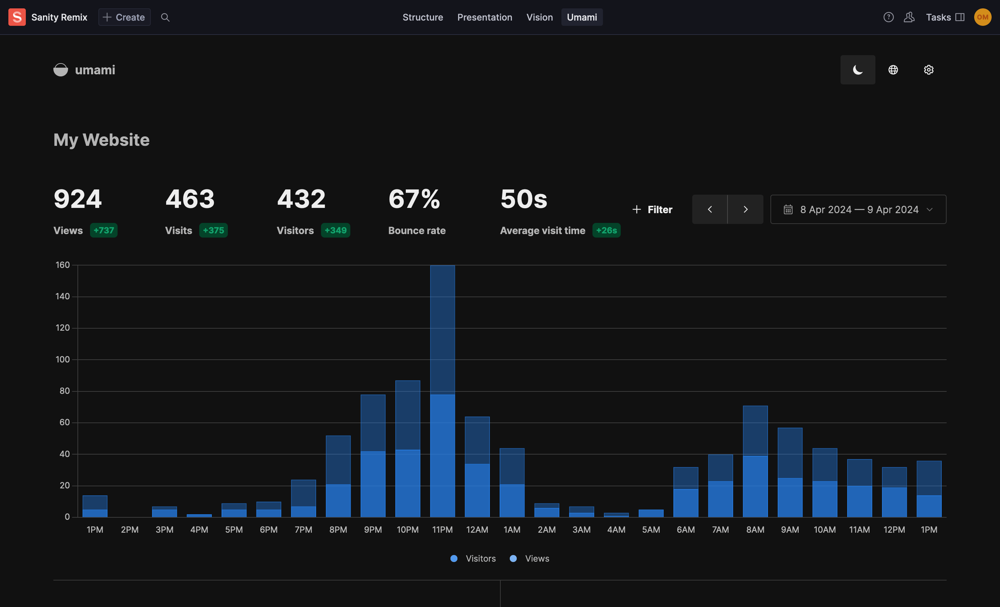

# sanity-plugin-umami-analytics-widget

> This is a **Sanity Studio v3** plugin.
> Inspired by https://www.sanity.io/plugins/plausible-analytics-widget by Stijn.



## Umami configuration

- Go to the "Websites" section and click "Edit" on the website you want to embed.
- Navigate to the "Share URL" tab.
- Click the "Enable share url" button.
- Copy the provided URL and paste it into the Umami plugin configuration.

## Installation

```sh
npm install sanity-plugin-umami-analytics-widget
```

## Usage

Add it as a plugin inside the dashboardTool in `sanity.config.ts` (or .js):

```ts
import {defineConfig} from 'sanity'
import {dashboardTool} from '@sanity/dashboard'
import {umamiWidget} from 'sanity-plugin-umami-analytics'

export default defineConfig({
  //...

  plugins: [
    dashboardTool({
      widgets: [
        umamiWidget({
          url: '<your-share-url-from-umami>',
          //example: https://eu.umami.is/share/XXXX/XXXX
        }),
      ],
    }),
  ],
})
```

### Options

- `url` - Required - the share url from Umami
- `title` - Optional - defaults to 'Umami Analytics'
- `height` - Optional - defaults to 'calc(100vh - 143px)'

## License

[MIT](LICENSE) © Ole Svennevig

## Develop & test

This plugin uses [@sanity/plugin-kit](https://github.com/sanity-io/plugin-kit)
with default configuration for build & watch scripts.

See [Testing a plugin in Sanity Studio](https://github.com/sanity-io/plugin-kit#testing-a-plugin-in-sanity-studio)
on how to run this plugin with hotreload in the studio.
